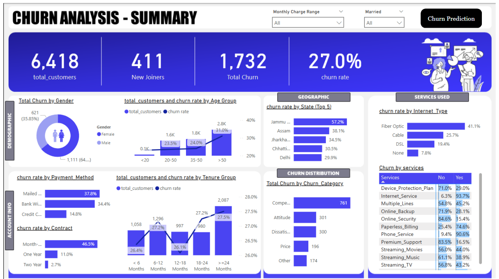

<h1 align="center">
  Customer Churn Analysis Prediction
</h1>

<div align="center">
  
</div>

---

[](https://www.buymeacoffee.com/gbraad)
[](https://forthebadge.com) &nbsp;

## Overview
This project focuses on analyzing and predicting customer churn for a telecom company using SQL Server, Power BI, and Machine Learning. The goal is to identify at-risk customers, understand churn drivers, and implement retention strategies based on data-driven insights.

## Skills & Technologies Used
- **Power BI**: Data visualization and dashboard creation
- **SQL Server**: Data storage, processing, and querying
- **Machine Learning**: Logistic Regression for churn prediction
- **Python**: Data manipulation and modeling (Pandas, NumPy, Scikit-learn)

## Objective
The primary aim of this project is to:
- Detect customer churn patterns.
- Predict churn probability using machine learning.
- Enable the telecom company to take proactive retention measures.

## Key Steps
- Data Collection and Preparation
- Data Transformation and Analysis
- Power BI Dashboard Development

## Key Techniques & Tools
### Techniques:
- **ETL & Data Processing**: Data transformation in SQL Server for optimized reporting.
- **Data Visualization**: Power BI dashboards for interactive insights.
- **Machine Learning**: Logistic Regression for churn prediction.
- **Feature Engineering**: Categorical encoding, numerical transformation, and segmentation.

### Tools & Libraries:
- **SQL Server**: Data management, cleaning, and querying.
- **Power BI**: Interactive dashboards and reporting.
- **Python**: Pandas, NumPy, and Scikit-learn for predictive modeling.

## Output & Business Impact
- Identified at-risk customers for targeted retention
- Estimated revenue loss from churn
- Insights on churn trends across demographics
- Churn prediction for customer retention strategies
- Increased retention and reduced financial loss
- Scalable strategy for industries like retail and healthcare

## Conclusion
This project demonstrates how SQL Server, Power BI, and Machine Learning can be integrated to analyze churn, predict customer behavior, and drive strategic decisions. The combination of advanced analytics and visualization enhances retention efforts, ensuring long-term business growth.

## How to Run the Project
1. **Set Up Database**:
   - Import the customer dataset into SQL Server.
   - Use the provided SQL scripts to clean and structure data.
2. **Load Data into Power BI**:
   - Connect Power BI to SQL Server.
   - Use the provided views (`vw_ChurnData`, `vw_JoinData`) for visualization.
3. **Train Predictive Model**:
   - Run the Python script to train and evaluate the logistic regression model.
4. **Deploy Dashboard**:
   - Publish the Power BI report for real-time monitoring.

## Future Enhancements
- Advanced ML models (Random Forest, XGBoost) for better accuracy
- Real-time data streaming for dynamic churn monitoring
- Automated retention alerts for at-risk customers

## Repository Structure
```
📂 Customer-Churn-Prediction
│── 📂 Data                # Raw and cleaned data files
│── 📂 SQL_Scripts         # SQL scripts for data processing
│── 📂 PowerBI_Dashboard   # Power BI report files
│── 📂 ML_Model            # Python scripts for churn prediction
│── 📂 background           # Canvas backgrounds for Power BI
│── 📂 images               # Images used in the dashboard
│── 📂 overview             # Power BI page snapshots & Overview.pdf
│── README.md              # Project documentation
```

## Contact
For questions or collaborations, feel free to connect on LinkedIn or GitHub.

